# CIVI Lens AI — Complete Technical Documentation

**Version:** Gen-6.0 (Phase B Hardened)
**Last Updated:** April 2026
**Classification:** Internal Engineering Reference

---

## Table of Contents

1. [Project Overview](#1-project-overview)
2. [System Architecture](#2-system-architecture)
3. [Technology Stack](#3-technology-stack)
4. [Service Topology](#4-service-topology)
5. [Data Models & Schema](#5-data-models--schema)
6. [API Reference](#6-api-reference)
7. [Security Architecture](#7-security-architecture)
8. [AI / ML Pipeline](#8-ai--ml-pipeline)
9. [Role-Based Access Control](#9-role-based-access-control)
10. [Complaint Lifecycle](#10-complaint-lifecycle)
11. [SLA Management](#11-sla-management)
12. [SOS Emergency System](#12-sos-emergency-system)
13. [Notification System](#13-notification-system)
14. [Webhook System](#14-webhook-system)
15. [Moderation & Appeal System](#15-moderation--appeal-system)
16. [Frontend Pages & User Flows](#16-frontend-pages--user-flows)
17. [Middleware Chain](#17-middleware-chain)
18. [Rate Limiting Strategy](#18-rate-limiting-strategy)
19. [Environment Configuration](#19-environment-configuration)
20. [Deployment Architecture](#20-deployment-architecture)
21. [Known Gaps & Roadmap](#21-known-gaps--roadmap)

---

## 1. Project Overview

**CIVI Lens AI** is a full-stack, AI-powered civic complaint management platform for Indian urban local bodies (ULBs). Citizens report issues (potholes, garbage, water leaks, encroachments), authorities track resolutions, emergencies are broadcast in real-time via SOS, and SLA accountability is enforced through transparent audit trails.

### Core Value Propositions

| Feature | Description |
|---|---|
| **AI Classification** | Detectron2 Mask R-CNN + Google Gemini Vision for automatic issue categorisation |
| **Real-time Alerts** | Socket.IO WebSocket broadcasts for SOS and status updates |
| **SLA Accountability** | Dual-timer SLA with automatic escalation through 4 levels |
| **Trust Scoring** | AI-driven trust scores affecting complaint priority |
| **Voice Reports** | Web Speech API transcript → AI analysis → auto-filed complaint |
| **Moderation** | Warning/ban system with mandatory justification + dual-admin permanent bans |
| **Webhook Integration** | HMAC-SHA256 signed event delivery to partner systems |
| **Security-First** | JWT + mandatory MFA for authority roles + Joi DTO + idempotency dedup |

---

## 2. System Architecture

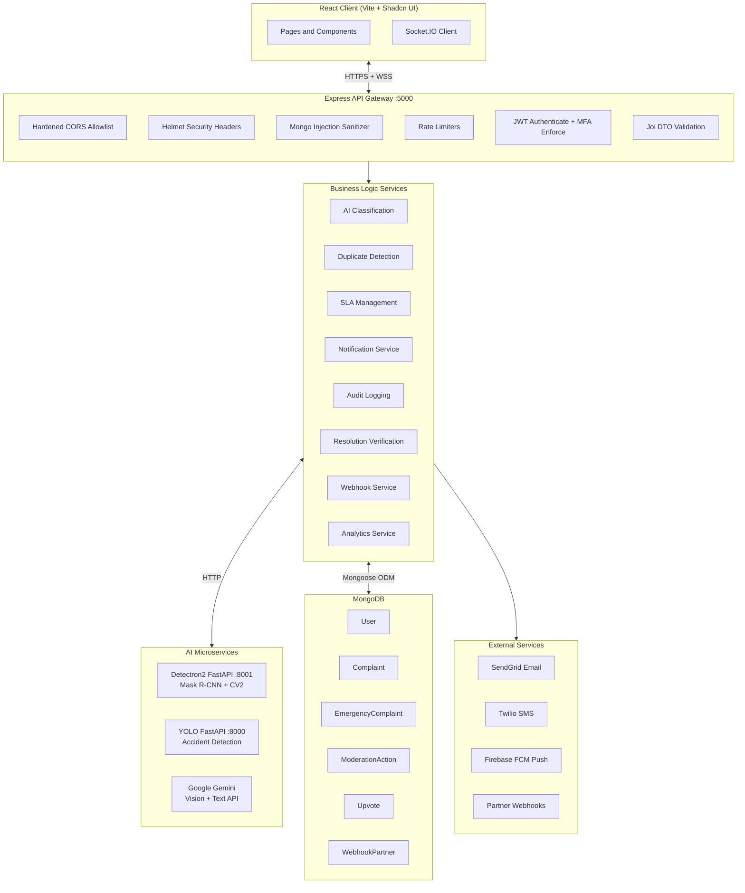
```mermaid
graph TB
    subgraph CLIENT["React Client (Vite + Shadcn UI)"]
        direction TB
        UI["Pages and Components"]
        WS_CLIENT["Socket.IO Client"]
    end

    subgraph GATEWAY["Express API Gateway :5000"]
        direction TB
        CORS["Hardened CORS Allowlist"]
        HELMET["Helmet Security Headers"]
        SANITIZE["Mongo Injection Sanitizer"]
        RATE["Rate Limiters"]
        AUTH["JWT Authenticate + MFA Enforce"]
        JOI["Joi DTO Validation"]
    end

    subgraph SERVICES["Business Logic Services"]
        SVC_AI["AI Classification"]
        SVC_DUP["Duplicate Detection"]
        SVC_SLA["SLA Management"]
        SVC_NOTIFY["Notification Service"]
        SVC_AUDIT["Audit Logging"]
        SVC_RESOLVE["Resolution Verification"]
        SVC_WEBHOOK["Webhook Service"]
        SVC_ANALYTICS["Analytics Service"]
    end

    subgraph AIML["AI Microservices"]
        direction LR
        DETECTRON["Detectron2 FastAPI :8001\nMask R-CNN + CV2"]
        YOLO["YOLO FastAPI :8000\nAccident Detection"]
        GEMINI["Google Gemini\nVision + Text API"]
    end

    subgraph DB["MongoDB"]
        M_USER["User"]
        M_COMPLAINT["Complaint"]
        M_EMERGENCY["EmergencyComplaint"]
        M_MODERATION["ModerationAction"]
        M_UPVOTE["Upvote"]
        M_WEBHOOK["WebhookPartner"]
    end

    subgraph EXTERNAL["External Services"]
        SENDGRID["SendGrid Email"]
        TWILIO["Twilio SMS"]
        FCM["Firebase FCM Push"]
        WEBHOOK_PARTNERS["Partner Webhooks"]
    end

    CLIENT <-->|HTTPS + WSS| GATEWAY
    GATEWAY --> SERVICES
    SERVICES <-->|HTTP| AIML
    SERVICES <-->|Mongoose ODM| DB
    SERVICES --> EXTERNAL
```

---

## 3. Technology Stack

### Backend

| Layer | Technology | Version | Purpose |
|---|---|---|---|
| Runtime | Node.js | 18+ | Server runtime |
| Framework | Express.js | 5.2.1 | HTTP routing |
| Database | MongoDB + Mongoose | 9.1.5 | Document store + ODM |
| Auth | jsonwebtoken | 9.0.3 | JWT access tokens |
| MFA | otplib | 13.4.0 | TOTP (Google Authenticator) |
| Password | bcryptjs | 3.0.3 | Password hashing (cost 12) |
| Validation | Joi | 18.1.1 | DTO schema validation |
| Real-time | Socket.IO | 4.8.3 | WebSocket events |
| Rate Limiting | express-rate-limit | 8.3.1 | Abuse protection |
| Security | Helmet | 8.1.0 | HTTP security headers |
| Sanitization | express-mongo-sanitize | 2.2.0 | NoSQL injection prevention |
| File Upload | Multer | 2.0.2 | Multipart form handling |
| Image Processing | Sharp | 0.34.5 | Image manipulation |
| AI Client | @google/generative-ai | 0.24.1 | Gemini API |
| Vision | @google-cloud/vision | 5.3.4 | Cloud Vision API |
| HTTP Client | Axios | 1.13.6 | Service-to-service HTTP |

### AI Microservices

| Service | Technology | Port | Description |
|---|---|---|---|
| Detectron2 | FastAPI + Python | 8001 | Mask R-CNN civic issue detection |
| Accident Detection | FastAPI + Python | 8000 | YOLO-based accident detection |

### Frontend

| Technology | Purpose |
|---|---|
| React 18 | UI framework |
| Vite 5 | Build tool + dev server |
| React Router 6 | Client-side routing |
| Shadcn/ui | Component library |
| Socket.IO Client | Real-time updates |
| Axios | API client |
| i18next | Internationalisation |

---

## 4. Service Topology

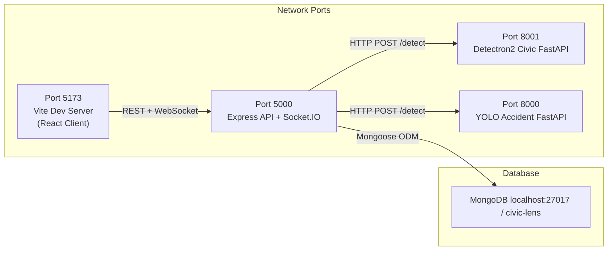
```mermaid
flowchart LR
    subgraph PORTS["Network Ports"]
        P5173["Port 5173\nVite Dev Server\n(React Client)"]
        P5000["Port 5000\nExpress API + Socket.IO"]
        P8001["Port 8001\nDetectron2 Civic FastAPI"]
        P8000["Port 8000\nYOLO Accident FastAPI"]
    end

    subgraph MONGO["Database"]
        ATLAS["MongoDB localhost:27017 / civic-lens"]
    end

    P5173 -->|REST + WebSocket| P5000
    P5000 -->|HTTP POST /detect| P8001
    P5000 -->|HTTP POST /detect| P8000
    P5000 -->|Mongoose ODM| ATLAS
```

### Request Flow Sequence

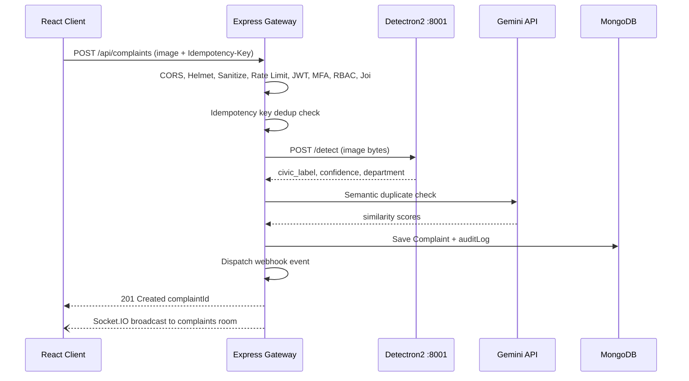
```mermaid
sequenceDiagram
    participant C as React Client
    participant G as Express Gateway
    participant D as Detectron2 :8001
    participant AI as Gemini API
    participant DB as MongoDB

    C->>G: POST /api/complaints (image + Idempotency-Key)
    G->>G: CORS, Helmet, Sanitize, Rate Limit, JWT, MFA, RBAC, Joi
    G->>G: Idempotency key dedup check
    G->>D: POST /detect (image bytes)
    D-->>G: civic_label, confidence, department
    G->>AI: Semantic duplicate check
    AI-->>G: similarity scores
    G->>DB: Save Complaint + auditLog
    G->>G: Dispatch webhook event
    G-->>C: 201 Created complaintId
    G--)C: Socket.IO broadcast to complaints room
```

---

## 5. Data Models and Schema

### 5.1 User Model

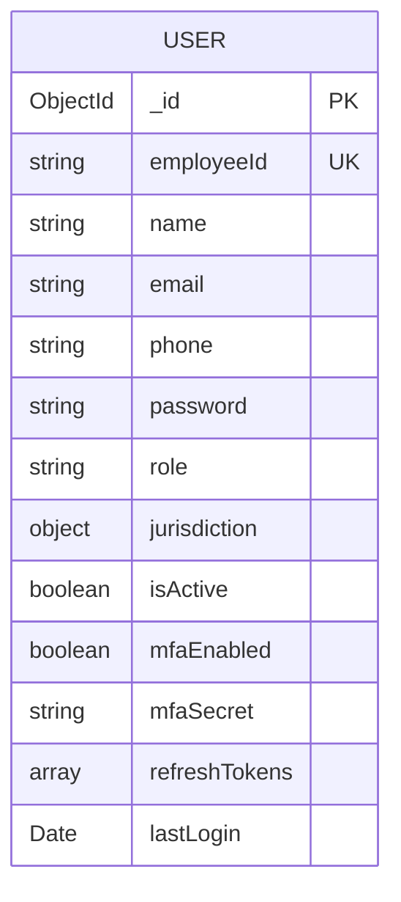
```mermaid
erDiagram
    USER {
        ObjectId _id PK
        string employeeId UK
        string name
        string email
        string phone
        string password
        string role
        object jurisdiction
        boolean isActive
        boolean mfaEnabled
        string mfaSecret
        array refreshTokens
        Date lastLogin
    }
```

**Role values:** `CITIZEN` | `MUNICIPAL_OPERATOR` | `MUNICIPAL_ADMIN` | `STATE_ADMIN`

MFA is mandatory for all non-citizen roles. Citizens auto-get `CIT-XXXXXX` employee IDs.

---

### 5.2 Complaint Model

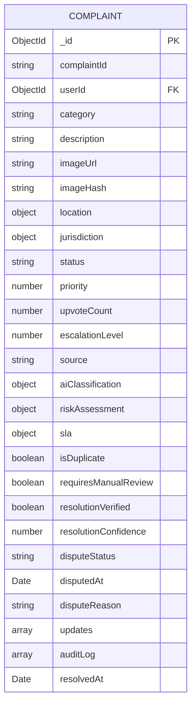
```mermaid
erDiagram
    COMPLAINT {
        ObjectId _id PK
        string complaintId
        ObjectId userId FK
        string category
        string description
        string imageUrl
        string imageHash
        object location
        object jurisdiction
        string status
        number priority
        number upvoteCount
        number escalationLevel
        string source
        object aiClassification
        object riskAssessment
        object sla
        boolean isDuplicate
        boolean requiresManualReview
        boolean resolutionVerified
        number resolutionConfidence
        string disputeStatus
        Date disputedAt
        string disputeReason
        array updates
        array auditLog
        Date resolvedAt
    }
```

**Complaint Status State Machine:**

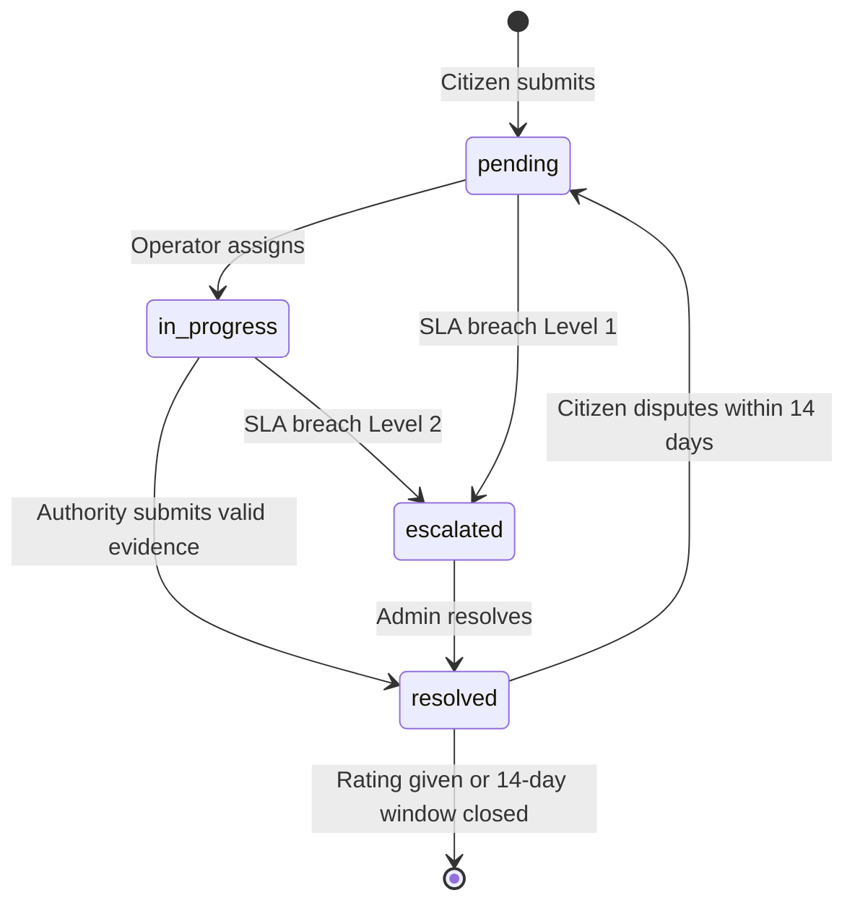
```mermaid
stateDiagram-v2
    [*] --> pending : Citizen submits
    pending --> in_progress : Operator assigns
    in_progress --> resolved : Authority submits valid evidence
    pending --> escalated : SLA breach Level 1
    in_progress --> escalated : SLA breach Level 2
    escalated --> resolved : Admin resolves
    resolved --> [*] : Rating given or 14-day window closed
    resolved --> pending : Citizen disputes within 14 days
```

---

### 5.3 EmergencyComplaint Model

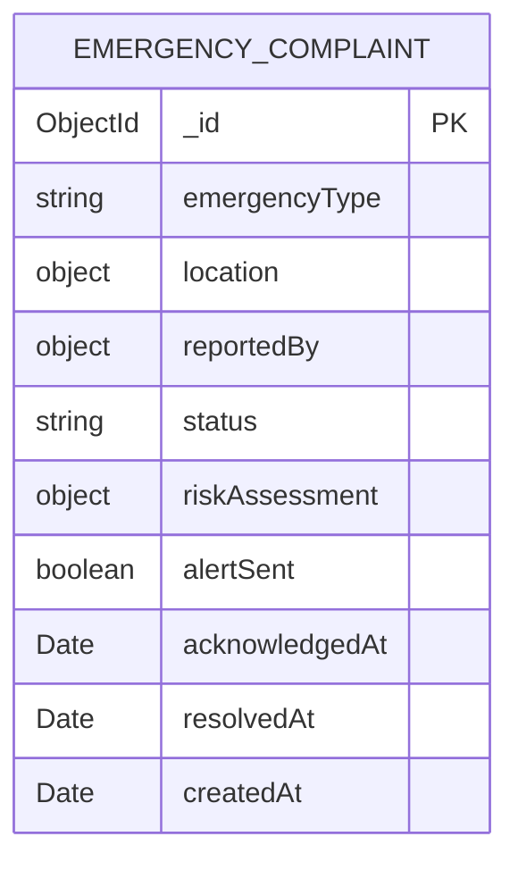
```mermaid
erDiagram
    EMERGENCY_COMPLAINT {
        ObjectId _id PK
        string emergencyType
        object location
        object reportedBy
        string status
        object riskAssessment
        boolean alertSent
        Date acknowledgedAt
        Date resolvedAt
        Date createdAt
    }
```

---

### 5.4 ModerationAction Model

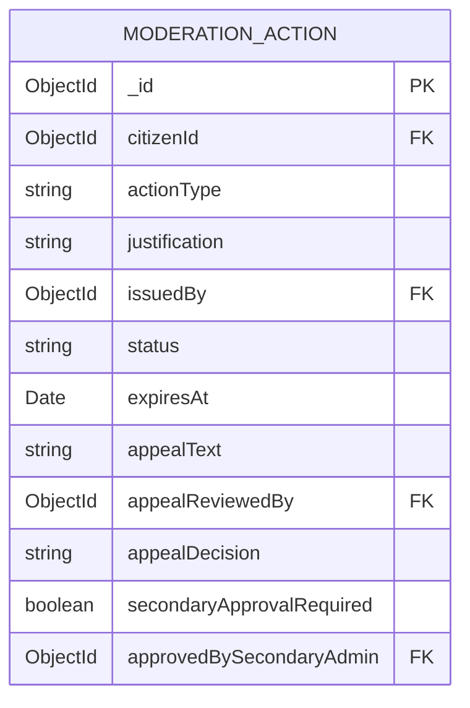
```mermaid
erDiagram
    MODERATION_ACTION {
        ObjectId _id PK
        ObjectId citizenId FK
        string actionType
        string justification
        ObjectId issuedBy FK
        string status
        Date expiresAt
        string appealText
        ObjectId appealReviewedBy FK
        string appealDecision
        boolean secondaryApprovalRequired
        ObjectId approvedBySecondaryAdmin FK
    }
```

**Status values:** `active` | `appealed` | `revoked` | `expired` | `pending_secondary_approval`

---

### 5.5 WebhookPartner Model

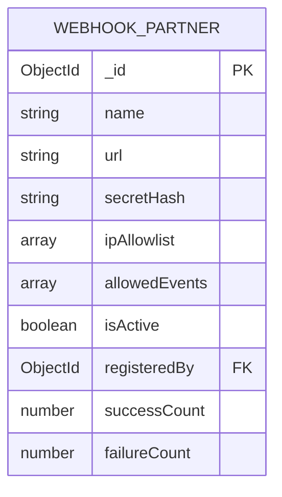
```mermaid
erDiagram
    WEBHOOK_PARTNER {
        ObjectId _id PK
        string name
        string url
        string secretHash
        array ipAllowlist
        array allowedEvents
        boolean isActive
        ObjectId registeredBy FK
        number successCount
        number failureCount
    }
```

---

## 6. API Reference

### Authentication — /api/auth

| Method | Endpoint | Auth | Description |
|---|---|---|---|
| POST | `/register` | Public | Citizen self-registration |
| POST | `/login` | Public | Login → JWT + refresh token |
| POST | `/refresh` | Public | Rotate refresh token pair |
| POST | `/logout` | JWT | Logout |
| GET | `/me` | JWT | Get current user profile |
| POST | `/mfa/setup` | JWT | Generate TOTP secret |
| POST | `/mfa/verify` | Public | Verify OTP → issue tokens |
| POST | `/staff` | JWT + Admin | Create operator/admin user |

---

### Complaints — /api/complaints

| Method | Endpoint | Auth | Rate Limit | Description |
|---|---|---|---|---|
| POST | `/` | Optional | 10/day + Idempotency-Key | Submit new complaint |
| GET | `/` | Optional | 100/min | List complaints (role-filtered) |
| GET | `/queue/review` | JWT + Operator | — | Low-confidence review queue |
| PATCH | `/:id/status` | JWT + Operator | — | Update status |
| POST | `/:id/resolve` | JWT + Operator | — | Submit resolution evidence (GPS+AI) |
| POST | `/:id/dispute` | JWT + Citizen | — | Dispute within 14 days |
| PATCH | `/:id/review` | JWT + Operator | — | Human review decision |
| POST | `/:id/community-media` | JWT | — | Community photo upload |

---

### Emergencies — /api/emergencies

| Method | Endpoint | Auth | Rate Limit | Description |
|---|---|---|---|---|
| POST | `/` | Optional | 100/hr dev, 2/hr prod | Submit SOS emergency |
| GET | `/` | JWT + Admin | — | List active emergencies |
| PATCH | `/:id/status` | JWT + Admin | — | Acknowledge or resolve |

---

### Moderation — /api/moderation

| Method | Endpoint | Auth | Description |
|---|---|---|---|
| POST | `/penalty` | JWT + Admin | Issue warning or ban |
| GET | `/my-penalties` | JWT + Citizen | View own sanctions |
| GET | `/pending-approval` | JWT + State Admin | Perm-bans awaiting 2nd admin |
| POST | `/:id/appeal` | JWT + Citizen | Submit appeal |
| POST | `/:id/review-appeal` | JWT + Different Admin | Decision on appeal |
| POST | `/:id/secondary-approve` | JWT + State Admin | 2nd approval for perm-ban |

---

### Other Routes

| Route Group | Path | Key Endpoints |
|---|---|---|
| Upvotes | `/api/upvotes` | POST (bot-checked), DELETE, GET /my/:id |
| Ratings | `/api/ratings` | POST (24h delay), GET /complaint/:id |
| Analytics | `/api/analytics` | hotspots, trends, summary, sla-report |
| Webhooks | `/api/webhooks` | POST (register), GET, PATCH /toggle, DELETE |
| Voice | `/api/complaints/voice` | POST (transcript → complaint) |
| Events | `/api/events` | Real-time event subscriptions |

---

## 7. Security Architecture

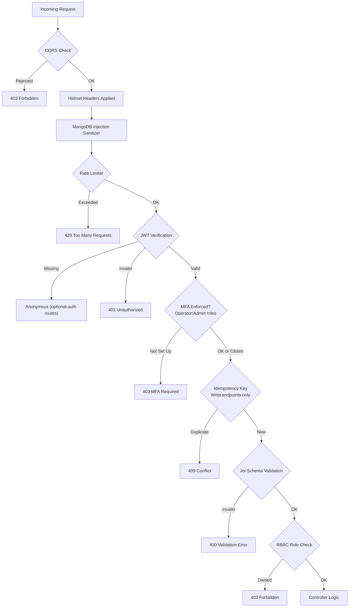
```mermaid
flowchart TD
    REQ["Incoming Request"] --> CORS{"CORS Check"}
    CORS -->|Rejected| B1["403 Forbidden"]
    CORS -->|OK| HELMET["Helmet Headers Applied"]
    HELMET --> SANITIZE["MongoDB Injection Sanitizer"]
    SANITIZE --> RATE{"Rate Limiter"}
    RATE -->|Exceeded| B2["429 Too Many Requests"]
    RATE -->|OK| JWT{"JWT Verification"}
    JWT -->|Missing| ANON["Anonymous (optional-auth routes)"]
    JWT -->|Invalid| B3["401 Unauthorized"]
    JWT -->|Valid| MFA{"MFA Enforced?\nOperator/Admin roles"}
    MFA -->|Not Set Up| B4["403 MFA Required"]
    MFA -->|OK or Citizen| IDEM{"Idempotency Key\nWrite endpoints only"}
    IDEM -->|Duplicate| B5["409 Conflict"]
    IDEM -->|New| JOI{"Joi Schema Validation"}
    JOI -->|Invalid| B6["400 Validation Error"]
    JOI -->|OK| RBAC{"RBAC Role Check"}
    RBAC -->|Denied| B7["403 Forbidden"]
    RBAC -->|OK| CTRL["Controller Logic"]
```

### Security Controls

| Control | Implementation | References |
|---|---|---|
| NoSQL Injection | express-mongo-sanitize | OWASP A03 |
| Security Headers | Helmet CSP + HSTS | OWASP A05 |
| Brute Force | authLimiter 20/15min | OWASP A07 |
| Bot Upvotes | 3-tier velocity detection | VULN-026 |
| Mass Assignment | Joi allowUnknown:false | VULN-006 |
| JWT Audience | aud: CIVI-Lens-Frontend | NFR-11 |
| Token Rotation | 7-day refresh, 5-session cap | VULN-002 |
| MFA Enforcement | TOTP mandatory for staff | VULN-035 |
| Idempotency | In-memory Map key dedup | FR-16-A |
| Webhook Auth | HMAC-SHA256 + 5-min replay | VULN-008 |
| Password Hashing | bcrypt cost-12 | — |

---

## 8. AI and ML Pipeline

### 8.1 Classification Pipeline

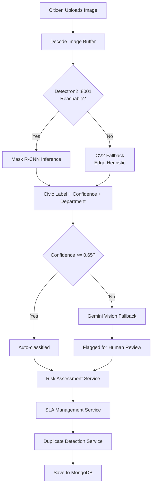
```mermaid
flowchart TD
    UPLOAD["Citizen Uploads Image"] --> DECODE["Decode Image Buffer"]
    DECODE --> DETECTRON{"Detectron2 :8001\nReachable?"}
    DETECTRON -->|Yes| MASK["Mask R-CNN Inference"]
    DETECTRON -->|No| CV2["CV2 Fallback\nEdge Heuristic"]
    MASK --> CIVIC["Civic Label + Confidence + Department"]
    CV2 --> CIVIC
    CIVIC --> THRESHOLD{"Confidence >= 0.65?"}
    THRESHOLD -->|Yes| AUTO["Auto-classified"]
    THRESHOLD -->|No| GEMINI["Gemini Vision Fallback"]
    GEMINI --> HUMAN["Flagged for Human Review"]
    AUTO --> RISK["Risk Assessment Service"]
    HUMAN --> RISK
    RISK --> SLA["SLA Management Service"]
    SLA --> DUP["Duplicate Detection Service"]
    DUP --> SAVE["Save to MongoDB"]
```

### 8.2 Duplicate Detection

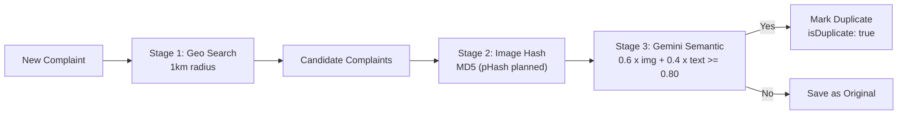
```mermaid
flowchart LR
    NEW["New Complaint"] --> GEO["Stage 1: Geo Search\n1km radius"]
    GEO --> CANDIDATES["Candidate Complaints"]
    CANDIDATES --> HASH["Stage 2: Image Hash\nMD5 (pHash planned)"]
    HASH --> SEMANTIC["Stage 3: Gemini Semantic\n0.6 x img + 0.4 x text >= 0.80"]
    SEMANTIC -->|Yes| MERGE["Mark Duplicate\nisDuplicate: true"]
    SEMANTIC -->|No| ORIGINAL["Save as Original"]
```

### 8.3 Resolution Evidence Verification

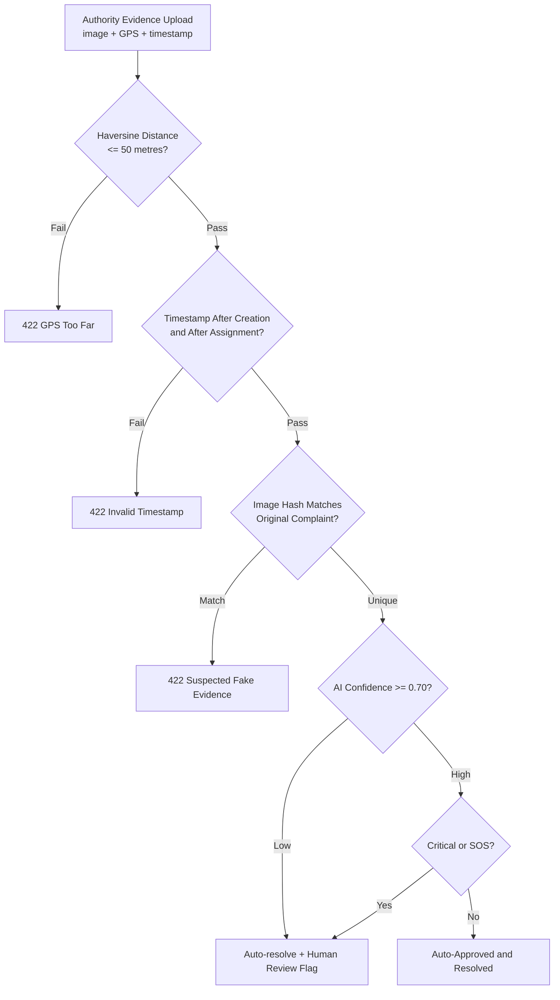
```mermaid
flowchart TD
    EVIDENCE["Authority Evidence Upload\nimage + GPS + timestamp"] --> GPS{"Haversine Distance\n<= 50 metres?"}
    GPS -->|Fail| R1["422 GPS Too Far"]
    GPS -->|Pass| TS{"Timestamp After Creation\nand After Assignment?"}
    TS -->|Fail| R2["422 Invalid Timestamp"]
    TS -->|Pass| HASH{"Image Hash Matches\nOriginal Complaint?"}
    HASH -->|Match| R3["422 Suspected Fake Evidence"]
    HASH -->|Unique| AI{"AI Confidence >= 0.70?"}
    AI -->|Low| HUMAN["Auto-resolve + Human Review Flag"]
    AI -->|High| CRITICAL{"Critical or SOS?"}
    CRITICAL -->|Yes| HUMAN
    CRITICAL -->|No| AUTO["Auto-Approved and Resolved"]
```

### 8.4 Detectron2 Civic Labels

| Label | Display | Department | Severity |
|---|---|---|---|
| `pothole` | Pothole / Road Damage | Public Works | Medium |
| `road_damage` | Road Surface Damage | Public Works | Medium |
| `road_obstruction` | Road Obstruction | Traffic Police | High |
| `garbage` | Garbage / Littering | Waste Management | Low |
| `garbage_dumping` | Illegal Dumping | Waste Management | Medium |
| `encroachment` | Encroachment | Municipal Corp | Medium |
| `infrastructure` | Infrastructure Issue | Urban Development | Medium |
| `unknown` | Unknown Issue | Municipal Corp | Low |

---

## 9. Role-Based Access Control

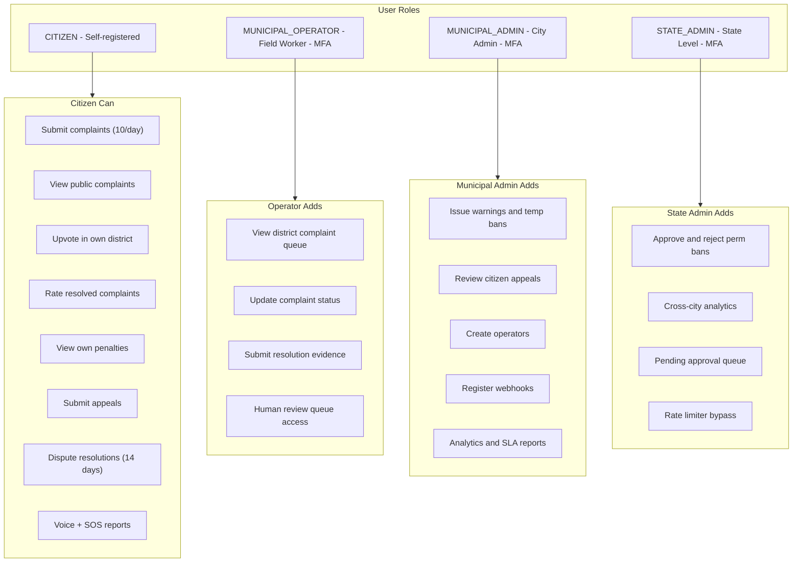
```mermaid
graph TD
    subgraph ROLES["User Roles"]
        CITIZEN["CITIZEN - Self-registered"]
        OPERATOR["MUNICIPAL_OPERATOR - Field Worker - MFA"]
        MADMIN["MUNICIPAL_ADMIN - City Admin - MFA"]
        SADMIN["STATE_ADMIN - State Level - MFA"]
    end

    subgraph C_PERMS["Citizen Can"]
        C1["Submit complaints (10/day)"]
        C2["View public complaints"]
        C3["Upvote in own district"]
        C4["Rate resolved complaints"]
        C5["View own penalties"]
        C6["Submit appeals"]
        C7["Dispute resolutions (14 days)"]
        C8["Voice + SOS reports"]
    end

    subgraph O_PERMS["Operator Adds"]
        O1["View district complaint queue"]
        O2["Update complaint status"]
        O3["Submit resolution evidence"]
        O4["Human review queue access"]
    end

    subgraph MA_PERMS["Municipal Admin Adds"]
        MA1["Issue warnings and temp bans"]
        MA2["Review citizen appeals"]
        MA3["Create operators"]
        MA4["Register webhooks"]
        MA5["Analytics and SLA reports"]
    end

    subgraph SA_PERMS["State Admin Adds"]
        SA1["Approve and reject perm bans"]
        SA2["Cross-city analytics"]
        SA3["Pending approval queue"]
        SA4["Rate limiter bypass"]
    end

    CITIZEN --> C_PERMS
    OPERATOR --> O_PERMS
    MADMIN --> MA_PERMS
    SADMIN --> SA_PERMS
```

> [!IMPORTANT]
> All authority roles (Operator, Municipal Admin, State Admin) require MFA to be enabled before any authenticated route will respond. The `authenticate` middleware returns `403 mfaSetupRequired: true` otherwise.

---

## 10. Complaint Lifecycle

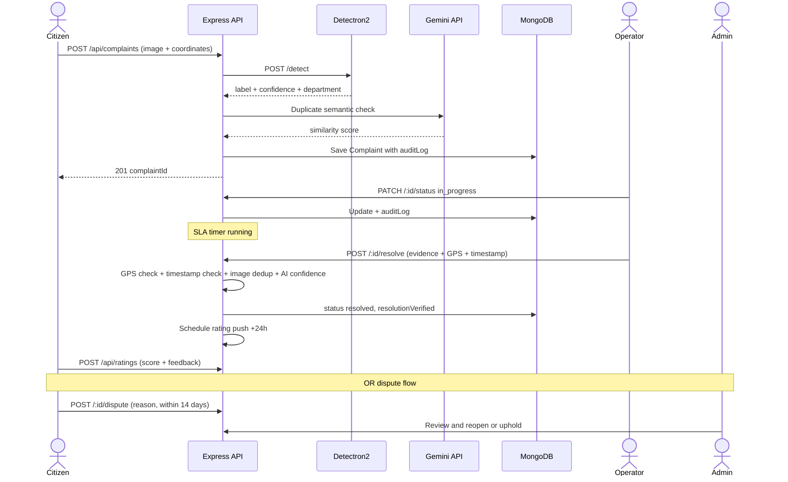
```mermaid
sequenceDiagram
    actor Citizen
    participant API as Express API
    participant Detectron as Detectron2
    participant Gemini as Gemini API
    participant DB as MongoDB
    actor Operator as Operator
    actor Admin as Admin

    Citizen->>API: POST /api/complaints (image + coordinates)
    API->>Detectron: POST /detect
    Detectron-->>API: label + confidence + department
    API->>Gemini: Duplicate semantic check
    Gemini-->>API: similarity score
    API->>DB: Save Complaint with auditLog
    API-->>Citizen: 201 complaintId

    Operator->>API: PATCH /:id/status in_progress
    API->>DB: Update + auditLog

    Note over API: SLA timer running

    Operator->>API: POST /:id/resolve (evidence + GPS + timestamp)
    API->>API: GPS check + timestamp check + image dedup + AI confidence
    API->>DB: status resolved, resolutionVerified
    API->>API: Schedule rating push +24h

    Citizen->>API: POST /api/ratings (score + feedback)
    note over Citizen, Admin: OR dispute flow
    Citizen->>API: POST /:id/dispute (reason, within 14 days)
    Admin->>API: Review and reopen or uphold
```

---

## 11. SLA Management

### 4-Level Escalation

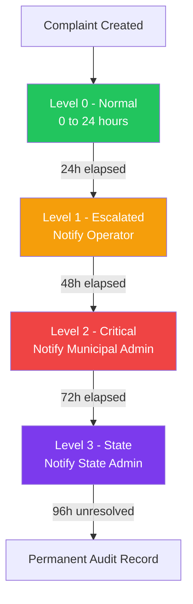
```mermaid
flowchart TD
    C["Complaint Created"] --> L0["Level 0 - Normal\n0 to 24 hours"]
    L0 -->|24h elapsed| L1["Level 1 - Escalated\nNotify Operator"]
    L1 -->|48h elapsed| L2["Level 2 - Critical\nNotify Municipal Admin"]
    L2 -->|72h elapsed| L3["Level 3 - State\nNotify State Admin"]
    L3 -->|96h unresolved| AUD["Permanent Audit Record"]

    style L0 fill:#22c55e,color:#fff
    style L1 fill:#f59e0b,color:#fff
    style L2 fill:#ef4444,color:#fff
    style L3 fill:#7c3aed,color:#fff
```

**Breach Probability:** `min(1.0, elapsed_hours / threshold) + 0.2 * (priority > 7) + 0.3 * (critical)`

---

## 12. SOS Emergency System

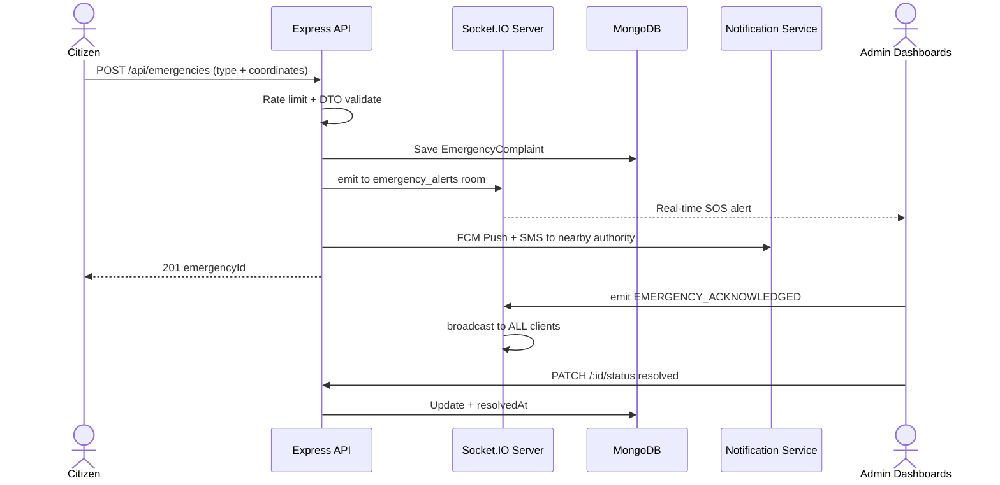
```mermaid
sequenceDiagram
    actor Citizen
    participant API as Express API
    participant Socket as Socket.IO Server
    participant DB as MongoDB
    participant Notify as Notification Service
    actor Admins as Admin Dashboards

    Citizen->>API: POST /api/emergencies (type + coordinates)
    API->>API: Rate limit + DTO validate
    API->>DB: Save EmergencyComplaint
    API->>Socket: emit to emergency_alerts room
    Socket-->>Admins: Real-time SOS alert
    API->>Notify: FCM Push + SMS to nearby authority
    API-->>Citizen: 201 emergencyId

    Admins->>Socket: emit EMERGENCY_ACKNOWLEDGED
    Socket->>Socket: broadcast to ALL clients
    Admins->>API: PATCH /:id/status resolved
    API->>DB: Update + resolvedAt
```

### Emergency Types and Severity

| Type | Severity | Est. Resolution |
|---|---|---|
| `electrical_hazard` | Critical | 2h |
| `fire` | Critical | 1h |
| `gas_leak` | Critical | 1h |
| `flooding` | Critical | 4h |
| `road_collapse` | High | 3h |
| `water_contamination` | High | 6h |
| `structural_damage` | High | 4h |
| `other_emergency` | Medium | 8h |

---

## 13. Notification System

### Channel Matrix

| Event | FCM Push | SMS | Email | Priority |
|---|---|---|---|---|
| SOS triggered | Yes | Yes | No | Critical bypass DND |
| SLA breach | Yes | No | Yes | High |
| Moderation penalty | Yes | No | Yes + appeal link | High |
| Appeal decision | Yes | No | Yes | High |
| Rating window open | Yes | No | No | Low |

### Service Flow

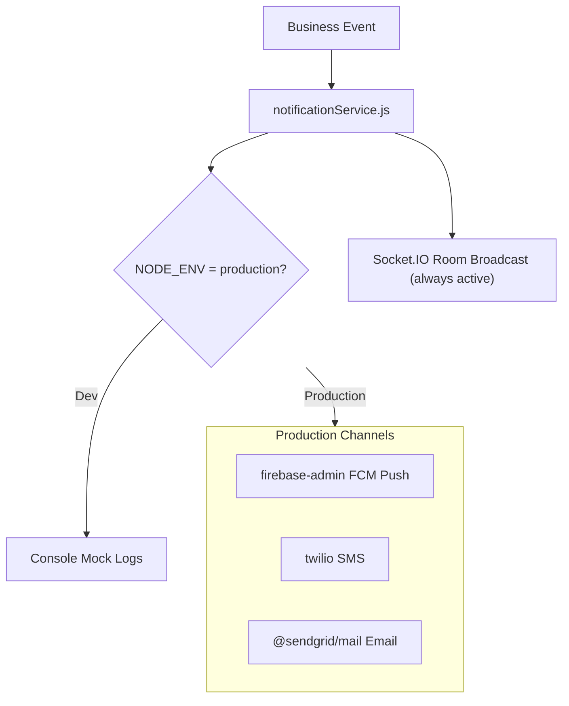
```mermaid
flowchart TD
    EVENT["Business Event"] --> NOTIFY["notificationService.js"]
    NOTIFY --> ENV{"NODE_ENV = production?"}
    ENV -->|Dev| MOCK["Console Mock Logs"]
    ENV -->|Production| CHANNELS["Active Channels"]

    subgraph CHANNELS["Production Channels"]
        FCM["firebase-admin FCM Push"]
        SMS["twilio SMS"]
        EMAIL["@sendgrid/mail Email"]
    end

    NOTIFY --> SOCKET["Socket.IO Room Broadcast (always active)"]
```

---

## 14. Webhook System

### Event Registration Flow

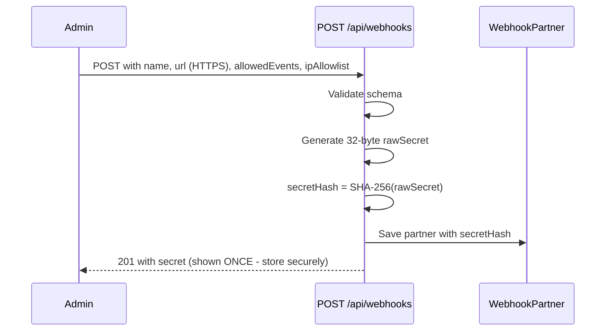
```mermaid
sequenceDiagram
    participant Admin
    participant API as POST /api/webhooks
    participant DB as WebhookPartner

    Admin->>API: POST with name, url (HTTPS), allowedEvents, ipAllowlist
    API->>API: Validate schema
    API->>API: Generate 32-byte rawSecret
    API->>API: secretHash = SHA-256(rawSecret)
    API->>DB: Save partner with secretHash
    API-->>Admin: 201 with secret (shown ONCE - store securely)
```

### Signed Delivery Flow

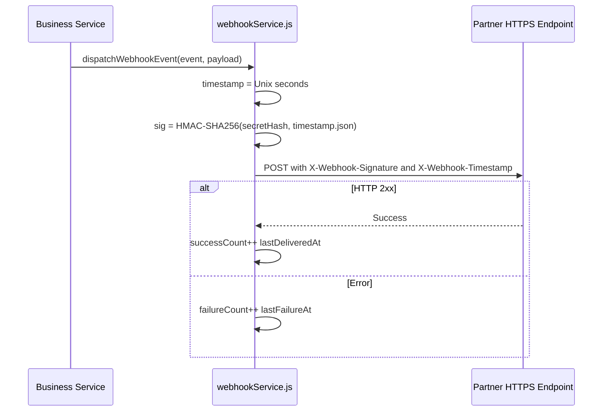
```mermaid
sequenceDiagram
    participant SVC as Business Service
    participant WH as webhookService.js
    participant PARTNER as Partner HTTPS Endpoint

    SVC->>WH: dispatchWebhookEvent(event, payload)
    WH->>WH: timestamp = Unix seconds
    WH->>WH: sig = HMAC-SHA256(secretHash, timestamp.json)
    WH->>PARTNER: POST with X-Webhook-Signature and X-Webhook-Timestamp
    alt HTTP 2xx
        PARTNER-->>WH: Success
        WH->>WH: successCount++ lastDeliveredAt
    else Error
        WH->>WH: failureCount++ lastFailureAt
    end
```

### Supported Events

| Event | Triggered When |
|---|---|
| `complaint.created` | New complaint filed |
| `complaint.status_changed` | Status updated |
| `complaint.resolved` | Evidence verified and resolved |
| `complaint.escalated` | SLA breach escalation |
| `sos.created` | Emergency report submitted |
| `sos.resolved` | Emergency resolved |
| `moderation.penalty_issued` | Citizen gets warning or ban |
| `sla.breached` | SLA threshold exceeded |

---

## 15. Moderation and Appeal System

### Penalty Lifecycle State Machine

```mermaid
stateDiagram-v2
    [*] --> active : Admin issues warning or temp_ban
    [*] --> pending_secondary_approval : Admin issues perm_ban

    pending_secondary_approval --> active : Different State Admin approves
    pending_secondary_approval --> revoked : Different State Admin rejects

    active --> appealed : Citizen submits appeal
    appealed --> revoked : Different admin APPROVES
    appealed --> active : Different admin REJECTS

    active --> expired : expiresAt reached
    active --> revoked : Admin manually revokes
```

### Dual-Admin Enforcement

```mermaid
flowchart TD
    A["Admin A issues perm_ban"] --> PEND["Status: pending_secondary_approval"]
    PEND --> B{"Admin B calls secondary-approve"}
    B --> SAME{"Is Admin B === Admin A?"}
    SAME -->|Yes| BLOCK["403 Cannot self-approve"]
    SAME -->|No| DEC{"approve: true?"}
    DEC -->|Yes| ACT["Status: active\nCitizen.isActive = false"]
    DEC -->|No| REV["Status: revoked\nNo action on citizen"]

    style BLOCK fill:#ef4444,color:#fff
    style ACT fill:#22c55e,color:#fff
    style REV fill:#64748b,color:#fff
```

---

## 16. Frontend Pages and User Flows

### Page Map by Role

```mermaid
mindmap
    root((CIVI Lens))
        Public Pages
            Home.jsx - Landing + live map
            Login.jsx - Auth + MFA flow
            SOS.jsx - Emergency button
        Citizen
            CitizenDashboard.jsx
            RegisterComplaint.jsx
            TrackComplaint.jsx
            VoiceReport.jsx
            AppealCenter.jsx - Penalties and appeals
        Operator
            OperatorDashboard.jsx - Work queue + map
        Municipal Admin
            MunicipalAdminDashboard.jsx
            Admin.jsx - Staff creation
        State Admin
            StateAdminDashboard.jsx - Cross-city analytics
        Emergency
            EmergencyDashboard.jsx - Live SOS feed
            ControlRoom.jsx - Operator control
```

### Citizen Complaint Flow

```mermaid
flowchart LR
    A["Open App"] --> B["Home or Login"]
    B --> C["Register Complaint"]
    C --> D["GPS Auto-Capture"]
    D --> E["Upload Photo"]
    E --> F["Submit with Idempotency-Key"]
    F --> G["AI Classifies and Routes"]
    G --> H["Track Complaint Timeline"]
    H --> I{"Resolved?"}
    I -->|Yes wait 24h| J["Rate Experience"]
    I -->|Dispute| K["Dispute Form within 14 days"]
```

---

## 17. Middleware Chain

```mermaid
flowchart TD
    REQ["HTTP Request"] --> M1["1. CORS allowlist check"]
    M1 --> M2["2. Helmet security headers"]
    M2 --> M3["3. CORS preflight handler"]
    M3 --> M4["4. MongoDB injection sanitizer"]
    M4 --> M5["5. JSON body parser (limit 10mb)"]
    M5 --> M6["6. generalLimiter 100/min per IP"]
    M6 --> ROUTER["Route Entry"]
    ROUTER --> M7["7. authenticate - JWT verify + DB lookup"]
    M7 --> M8["8. MFA enforcement for authority roles"]
    M8 --> M9["9. authorize - RBAC role check"]
    M9 --> M10["10. Route-specific rate limiter"]
    M10 --> M11["11. requireIdempotencyKey (write endpoints)"]
    M11 --> M12["12. Joi schema validate"]
    M12 --> CTRL["Controller Logic"]
```

---

## 18. Rate Limiting Strategy

| Limiter | Window | Max | Applied To |
|---|---|---|---|
| `generalLimiter` | 1 min | 100 | All /api/ routes |
| `authLimiter` | 15 min | 20 | Auth endpoints |
| `complaintSubmitLimiter` | 24 hours | 10 | POST /api/complaints |
| `sosLimiter` | 1 hour | 100 dev / 2 prod | POST /api/emergencies |
| `upvoteLimiter` | 24 hours | 50 | POST /api/upvotes |

**Bot Upvote Detection (software layer on top of rate limits):**

| Pattern | Threshold | Action |
|---|---|---|
| Velocity burst | > 10 upvotes in 5 minutes | 429 soft-block |
| New account rapid | > 3 in 5 min for accounts < 24h old | 429 soft-block |
| Daily overuse | > 20 upvotes in one day | 429 soft-block |

---

## 19. Environment Configuration

```env
# Database
MONGODB_URI=mongodb://localhost:27017/civic-lens

# JWT
JWT_SECRET=256-bit-random-string
JWT_EXPIRES_IN=24h

# CORS
CORS_ORIGIN=http://localhost:5173,https://yourdomain.gov

# AI Services
GEMINI_API_KEY=your-gemini-api-key
GOOGLE_CLOUD_VISION_KEY=your-gcp-key

# Notifications (production)
SENDGRID_API_KEY=SG.xxxxxxxx
TWILIO_ACCOUNT_SID=ACxxxxxxxxxx
TWILIO_AUTH_TOKEN=xxxxxxxxxx
TWILIO_FROM=+1234567890
FIREBASE_SERVICE_ACCOUNT={"type":"service_account",...}

# AI Microservices
DETECTRON_SERVICE_URL=http://localhost:8001
ACCIDENT_SERVICE_URL=http://localhost:8000

# App
PORT=5000
NODE_ENV=development
FRONTEND_URL=http://localhost:5173
```

> [!WARNING]
> Never commit .env to version control. Rotate JWT_SECRET and all API keys immediately after any exposure.

---

## 20. Deployment Architecture

### Development (Current)

```mermaid
flowchart LR
    subgraph DEV["Developer Machine"]
        N["Node Express :5000"]
        V["Vite Dev :5173"]
        D1["Detectron2 uvicorn :8001"]
        D2["YOLO uvicorn :8000"]
        M["MongoDB :27017"]
    end
    N --> M
    V --> N
```

### Target Production (Kubernetes)

```mermaid
graph TB
    NGINX["Nginx Ingress + TLS"]

    subgraph K8S["Kubernetes Cluster"]
        REACT["React Static\nnginx pod"]
        API1["Express API Pod 1"]
        API2["Express API Pod 2"]
        AI_D["Detectron2 GPU Pod"]
        AI_Y["YOLO GPU Pod"]
        MESH["Istio mTLS Service Mesh"]
    end

    subgraph DATA["Data Layer"]
        ATLAS["MongoDB Atlas M30+"]
        REDIS["Redis Cluster\nRate limits + Idempotency"]
        S3["AWS S3 Media Storage"]
    end

    subgraph EVENTS["Event Bus"]
        KAFKA["Apache Kafka\nSLA events + Webhooks"]
    end

    NGINX --> REACT
    NGINX --> API1
    NGINX --> API2
    API1 --> AI_D
    API1 --> AI_Y
    API1 --> DATA
    API1 --> KAFKA
```

---

## 21. Known Gaps and Roadmap

### Phase C — Production Hardening (Next Sprint)

| Priority | Item | Description |
|---|---|---|
| P0 Critical | Real GPS in SOS.jsx | Replace hardcoded New Delhi coordinates with navigator.geolocation |
| P0 Critical | S3 Media Storage | Replace base64-in-MongoDB with S3 upload + pre-signed URLs |
| P0 Critical | PII Encryption | AES-256-GCM on phone and email fields in User.js |
| P0 Critical | Redis Idempotency | Replace in-memory Map with Redis for multi-instance support |
| P1 High | Perceptual Hashing | Replace MD5 with pHash for image similarity detection |
| P1 High | Real AI Resolution | Replace random confidence stub with actual computer vision call |
| P1 High | Field Worker Role | Add FIELD_WORKER role with GPS-scoped task access |
| P2 Medium | Safety Hazard Filter | Hide public_safety_hazard category from feeds until resolved |
| P2 Medium | Translation Files | Add locales/hi and locales/en for i18next |
| P2 Medium | PWA Offline Mode | Service worker + IndexedDB + Background Sync API |
| P3 Low | Kafka Event Bus | Replace direct dispatch with Kafka consumer pattern |
| P3 Low | Predictive Maintenance | ML model on historical data for preventive scheduling |
| P3 Low | Signed Pagination | HMAC-signed opaque cursors instead of offset pagination |

---

## Appendix A — File Tree

```
CIVI Lens/
├── server/
│   ├── controllers/
│   ├── middleware/
│   │   ├── authMiddleware.js     JWT + MFA + RBAC
│   │   ├── idempotency.js        Idempotency-Key dedup
│   │   ├── rateLimiter.js        Rate limit profiles
│   │   └── validate.js           Joi DTO schemas
│   ├── models/
│   │   ├── Complaint.js          Core complaint + dispute fields
│   │   ├── EmergencyComplaint.js SOS emergencies
│   │   ├── ModerationAction.js   Penalties + dual-admin
│   │   ├── Upvote.js             Unique upvote constraint
│   │   ├── User.js               Auth + MFA + RBAC
│   │   └── WebhookPartner.js     HMAC webhook registry
│   ├── routes/
│   │   ├── complaintRoutes.js    resolve + dispute endpoints
│   │   ├── moderationRoutes.js   my-penalties + dual-admin
│   │   ├── upvoteRoutes.js       bot anomaly detection
│   │   └── webhookRoutes.js      webhook partner management
│   ├── services/
│   │   ├── notificationService.js    FCM + SMS + Email
│   │   ├── resolutionVerificationService.js  GPS + AI validation
│   │   ├── webhookService.js         HMAC dispatch + stats
│   │   └── ... (17 more services)
│   └── index.js                  App bootstrap + Socket.IO
├── client/src/
│   ├── pages/                    14 page components
│   ├── components/               Reusable Shadcn components
│   ├── context/                  React context providers
│   └── i18n.js                   i18next config
├── ai_detectron/
│   ├── main.py                   FastAPI :8001 civic detection
│   └── model.py                  Mask R-CNN + CV2 fallback
├── ai_service/
│   └── main.py                   FastAPI :8000 YOLO accidents
└── CIVIC_LENS_DOCUMENTATION.md   Original design specification
```

---

## Appendix B — Quick Start

**1. Backend API**
```powershell
cd "e:\Projects\CIVI Lens\server"
npm install
node index.js
```

**2. React Client**
```powershell
cd "e:\Projects\CIVI Lens\client"
npm install
npm run dev
```

**3. Detectron2 AI Service**
```powershell
cd "e:\Projects\CIVI Lens\ai_detectron"
.\venv\Scripts\Activate.ps1
uvicorn main:app --host 0.0.0.0 --port 8001 --reload
```

**4. YOLO Accident Service**
```powershell
cd "e:\Projects\CIVI Lens\ai_service"
.\venv\Scripts\Activate.ps1
uvicorn main:app --host 0.0.0.0 --port 8000 --reload
```

**5. Verify All Services**
```powershell
curl http://localhost:5000/health
curl http://localhost:8001/
curl http://localhost:8000/
```

---

*CIVI Lens AI Technical Documentation — Gen-6.0 — April 2026*
